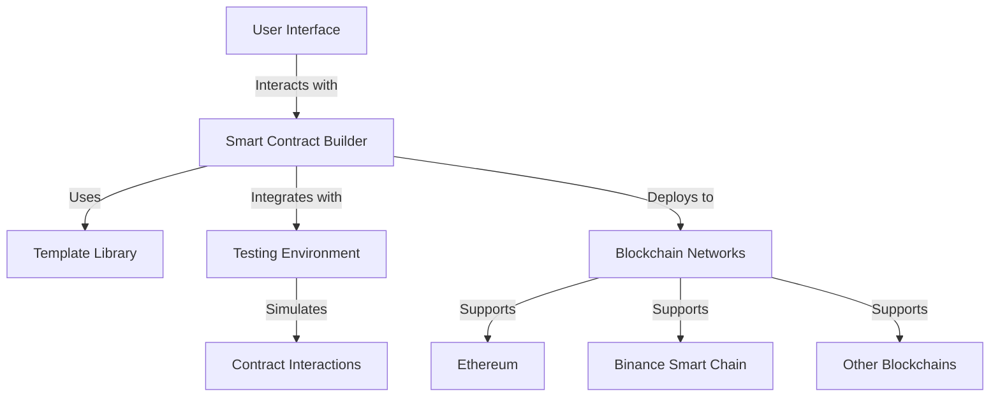

# Mantle Smart Contract Builder : pendle Supported

## Tagline
**Empowering Developers to Create, Deploy, and Manage Smart Contracts Effortlessly.**

## Problem Statement
In the rapidly evolving world of blockchain technology, developers face numerous challenges when creating and deploying smart contracts. These challenges include complex coding requirements, lack of user-friendly interfaces, and difficulties in testing and deploying contracts across multiple blockchain platforms. As a result, many developers struggle to bring their ideas to life efficiently.

## Solution Statement
The **Smart Contract Builder** addresses these challenges by providing a comprehensive, user-friendly platform that simplifies the entire smart contract development process. With pre-built templates, testing tools, and multi-blockchain support, developers can focus on innovation rather than the intricacies of coding and deployment.

## Features
- **User-Friendly Interface**: Intuitive design for seamless navigation and contract creation.
- **Multi-Blockchain Support**: Deploy contracts on Ethereum, Binance Smart Chain, and more.
- **Template Library**: Access to pre-built templates for common contract types (ERC20, ERC721, etc.).
- **Testing Environment**: Built-in tools to simulate contract interactions and ensure functionality.
- **Deployment Tools**: Step-by-step guidance for deploying contracts on various blockchains.
- **Version Control**: Track contract versions and changes easily.

## Architecture Diagram


## Installation
To get started with the Smart Contract Builder, follow these steps:

1. **Clone the repository**:
   ```bash
   git clone https://github.com/yourusername/smart-contract-builder.git
   cd smart-contract-builder
   ```

2. **Install dependencies**:
   ```bash
   npm install
   ```

3. **Run the application**:
   ```bash
   npm run dev
   ```

4. Open your browser and navigate to `http://localhost:3000`.

## Usage
1. **Create a New Contract**:
   - Click on the "Create Contract" button.
   - Choose a template or start from scratch.
   - Fill in the required fields and parameters.

2. **Test Your Contract**:
   - Use the built-in testing tools to simulate interactions.
   - Review the test results and make necessary adjustments.

3. **Deploy Your Contract**:
   - Once satisfied with your contract, proceed to the deployment section.
   - Follow the prompts to deploy on your chosen blockchain.

4. **Manage Contracts**:
   - View and manage your deployed contracts from the dashboard.
   - Access contract details, transaction history, and more.

## Configuration
You can customize the application by modifying the configuration files located in the `config` directory. Here are some key settings:

- **Network Configuration**: Set the blockchain networks you want to support.
- **Template Management**: Add or modify contract templates.

## Contributing
We welcome contributions! If you'd like to contribute to the Smart Contract Builder, please follow these steps:

1. Fork the repository.
2. Create a new branch (`git checkout -b feature/YourFeature`).
3. Make your changes and commit them (`git commit -m 'Add some feature'`).
4. Push to the branch (`git push origin feature/YourFeature`).
5. Open a pull request.

## License
This project is licensed under the MIT License. See the [LICENSE](LICENSE) file for details.

## Contact
For questions or feedback, please reach out to:

- **Your Name** - [your.email@example.com](mailto:your.email@example.com)
- **GitHub**: [yourusername](https://github.com/yourusername)

---

Thank you for using the Smart Contract Builder! We hope it helps you in your blockchain development journey.
